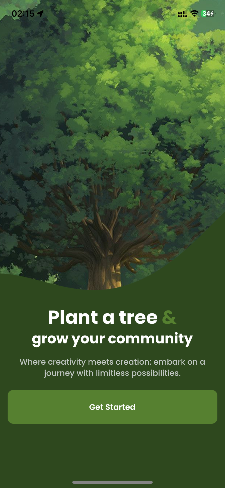
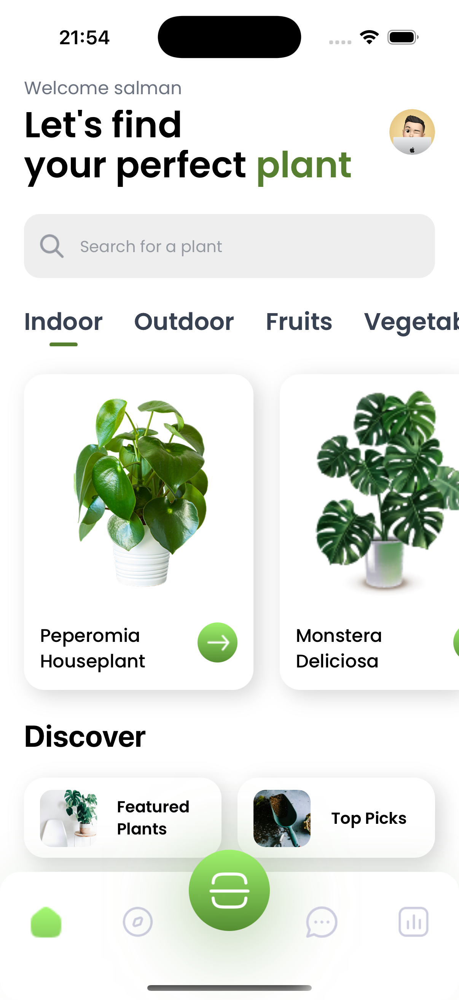
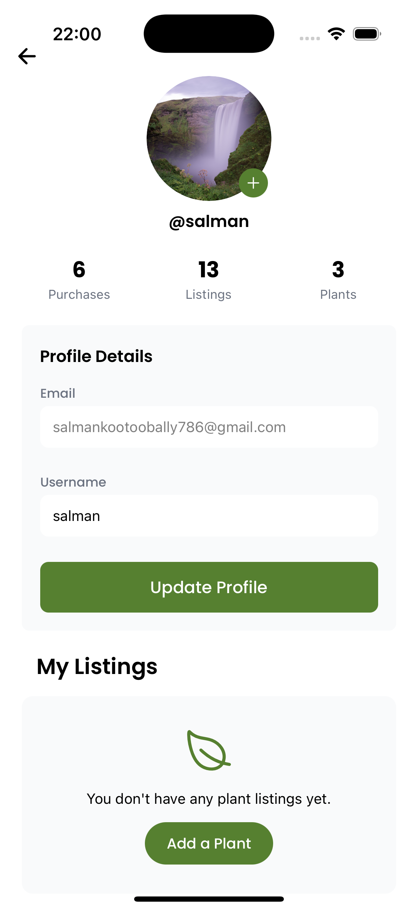
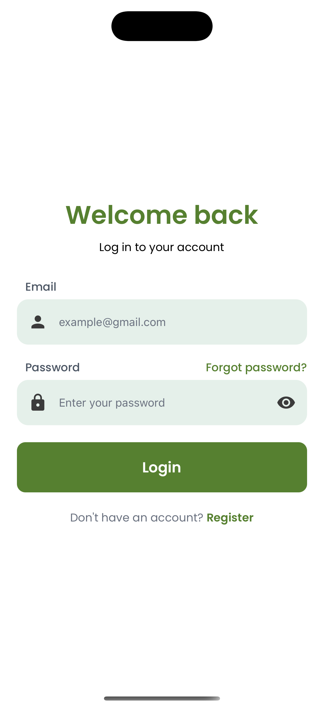
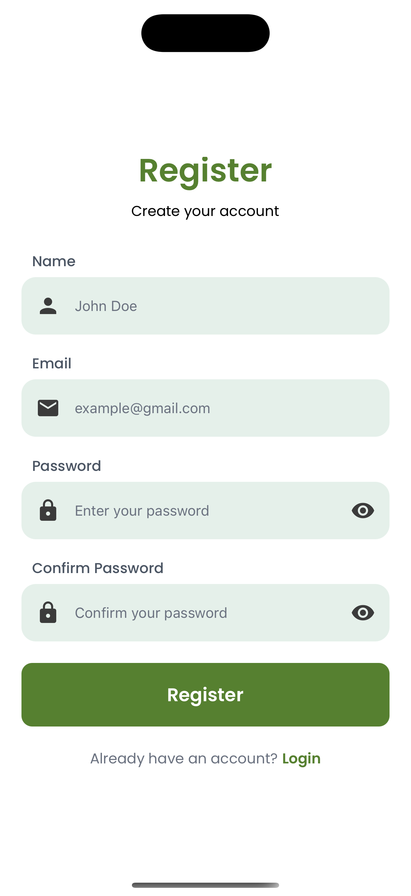
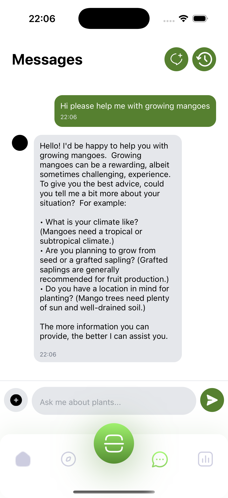

# Chatbot Template

This project is a React Native template for building AI chat applications on Android and iOS. It uses Google Gemini for chat functionality and Supabase for authentication and storage. The original plant identification and shopping features were removed to serve as a lightweight starting point for multiple chatbot experiences.

## Features
- 💬 **AI Chatbot**: Chat with domain‑specific bots. Multiple bots can be configured (e.g. parking reservations, room bookings).
- 🎨 **Configurable Palette**: Colors are defined in `config/colors.js` so the palette can easily be customized.
- 📱 **Cross-Platform**: Works on both Android and iOS using Expo.
- 🔥 **Tech Stack**: React Native, Expo and Supabase backend.

## Screenshots

### Onboarding & Home
<div style="display: flex; flex-wrap: wrap; gap: 10px;">
  
  
  
</div>

### Authentication
<div style="display: flex; flex-wrap: wrap; gap: 10px;">
  
  
</div>


### Chat
<div style="display: flex; flex-wrap: wrap; gap: 10px;">
  
</div>


## Installation & Setup

### Prerequisites
- Node.js (Latest LTS recommended)
- Expo CLI
- Android Studio & Xcode (for Android and iOS development)
- Supabase account

### Clone the Repository
```sh
git clone https://github.com/yourusername/anty.git
cd anty
```

### Install Dependencies
```sh
npm install
# or
yarn install
```

### Setting up Supabase
1. Create a Supabase project at [supabase.com](https://supabase.com/)
2. Navigate to **Settings > API** and copy the **Project URL** and **Anon Key**.
3. Set up authentication and database tables for storing user data and any domain‑specific information your bots might need.
4. Create the tables required for your project, for example:
   - `users`: Store user profiles
   - add other domain‑specific tables as needed

### Environment Variables
Create a `.env.local` file in the root directory and add the following:
```sh
EXPO_PUBLIC_SUPABASE_URL=your-supabase-url
EXPO_PUBLIC_SUPABASE_ANON_KEY=your-supabase-anon-key
EXPO_PUBLIC_GEMINI_API_KEY=your-openai-api-key # For chatbot functionality
# Add any additional environment variables your bots require here
```

### Running the App
```sh
npx expo start
```

## Deployment
### Building for Production

#### Setup EAS Build (for development build)
```sh
npm install -g eas-cli
eas login
eas build:configure
```

#### Android APK/Bundle
```sh
eas build -p android --profile preview
# For production release
eas build -p android --profile production
```

#### iOS Release
```sh
eas build -p ios --profile preview
# For production release
eas build -p ios --profile production
```
